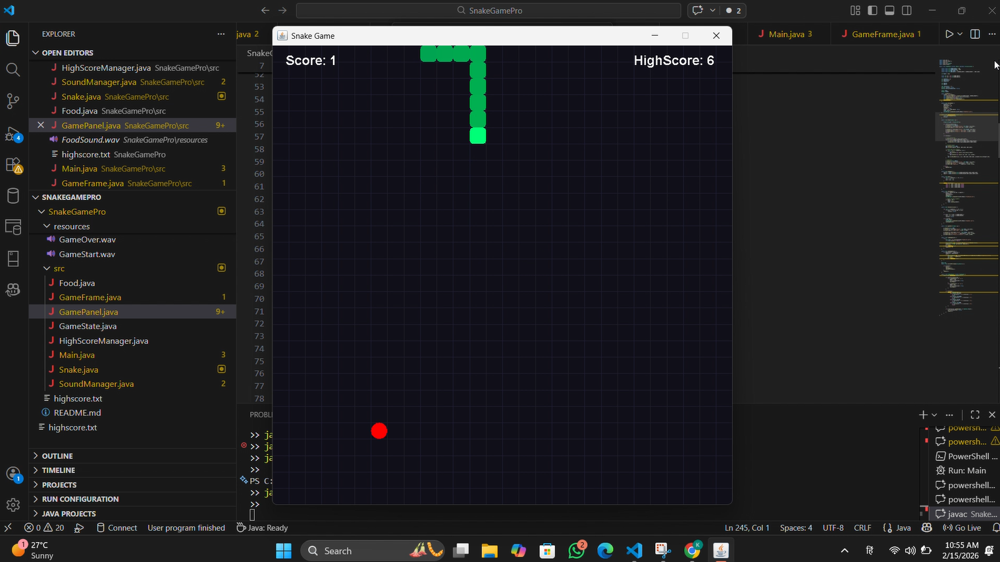

🐍 SnakeGamePro – Advanced Java Snake Game

# 🐍 SnakeGamePro

A modern, animated Snake game built using Java Swing.  
This project demonstrates object-oriented design, event-driven programming, file handling, and audio integration in Java.

---

## 🎮 Overview

SnakeGamePro is a feature-rich desktop implementation of the classic Snake game.  
It includes animated visuals, difficulty selection, sound effects, and persistent highscore tracking.

The project was designed to showcase clean architecture, modular design, and real-time game logic using Java.

---

## ✨ Features

- 🎨 Animated snake body with smooth rendering
- 🧠 Easy and Hard difficulty modes
- 📈 Dynamic speed increase as score grows
- 🔊 Sound effects (Game Start, Food Collection, Game Over)
- 🏆 Persistent highscore system (file-based storage)
- 🔄 Restart functionality
- 🎮 Keyboard-controlled movement
- 🧱 Grid-based rendering system
- 💻 Built using Java Swing

---

## 🎮 Controls

| Key | Action |
|------|--------|
| 1 | Start Easy Mode |
| 2 | Start Hard Mode |
| ⬅ Arrow | Move Left |
| ➡ Arrow | Move Right |
| ⬆ Arrow | Move Up |
| ⬇ Arrow | Move Down |
| R | Restart Game |

---

## 🛠 Technologies Used

- **Java**
- **Java Swing (GUI)**
- **Java Timer (Game Loop)**
- **Java Sound API**
- **File I/O (Highscore Persistence)**
- Object-Oriented Programming (OOP)

---

## 📂 Project Structure

SnakeGamePro
│
├── bin
├── resources
│ ├── FoodSound.wav
│ ├── GameStart.wav
│ └── GameOver.wav
├── highscore.txt
└── src
├── GameFrame.java
├── GamePanel.java
└── SoundManager.java

---

## ▶ How To Run

1. Open terminal inside the project directory.
2. Compile the source files:

---
javac -d bin src*.java

3. Run the game:

---

java -cp bin GameFrame

---

## 🧠 Key Concepts Demonstrated

- Event-driven programming with KeyListener
- Real-time game loop using Swing Timer
- Collision detection logic
- Dynamic difficulty adjustment
- File handling for persistent data
- Modular class design (GameFrame, GamePanel, SoundManager)

---

## 🚀 Future Enhancements

- Background music loop
- Particle effects
- Snake eye animation
- Pause system
- Fullscreen support
- Online leaderboard
- Game menu UI improvements

---

## 📸 Preview

## 📸 Gameplay Preview

---

## 👨‍💻 Author

Developed by **Krushna Malode**

---

## 📄 License

This project is open-source and available for educational and personal use.
